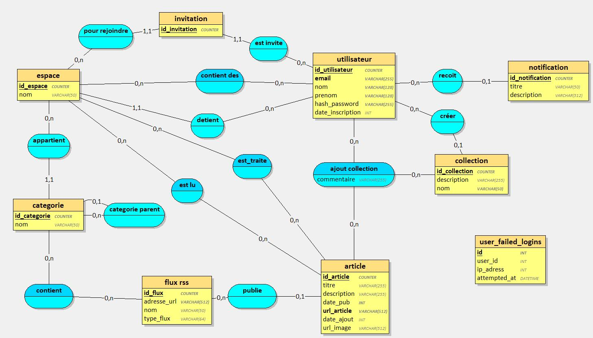

# 📰 MyRSS


## Lecteur de flux RSS avancé et collaboratif

Un projet développé à Tours, France.

## Fonctionnalités

_Toutes les fonctionnalitées notées ci dessous ne sont pas forcement encore disponibles pour l'instant mais seront ajoutées au fur et à mesure du temps._

- Création d'espaces collaboratifs avec différents utilisateurs.
- Ajout de flux RSS dans des catégories spécifiques.
- Prise en charge des fluxs RSS, des chaînes YouTube, Google News, etc.
- Recommandations de fluxs RSS et d'articles entre utilisateurs.
- Taux de rafraîchissement des articles inférieur à 5 minutes.
- Export des articles aux formats xlsx, csv, json, ...

## Technologies utilisées

MyRSS s'appuie sur plusieurs projets open source pour fonctionner efficacement :

- [moment.js](https://github.com/moment/moment/) - Une bibliothèque JavaScript pour l'analyse, la validation, la manipulation et le formatage des dates.
- [SimpleAntiBruteForce](https://github.com/GatienFrenchDev/SimpleAntiBruteForce) - Une petite bibliothèque PHP codé par moi même pour l'occasion afin de gérer les tentatives de connexion erronées sur le formulaire de connexion

MyRSS est basé sur PHP 8.2 et MariaDB 10.4 (testé également sous Ubuntu 24.04 avec PHP 8.3.6 et MySQL 8.0.36-2ubuntu3)

## Déploiement local sous Windows pour environnement de développement

- Téléchargez d'abord [XAMPP](https://www.apachefriends.org/fr/index.html) avec les modules `Apache` et `MySQL` (l'installation par défaut suffira).
- Une fois installé, lancez XAMPP en tant qu'administrateur (clic droit sur `xampp.exe` > `Exécuter en tant qu'administrateur`).
- Démarrez `Apache` et `MySQL` depuis le panneau de contrôle de XAMPP.
- Téléchargez le code source de ce dépôt (bouton vert en haut à droite sur le dépôt, intitulé `<> Code`, puis `Download ZIP`).
- Placez la totalité des fichiers contenu dans le dossier `MyRSS-Main` de l'archive dans le dossier `C:/xampp/htdocs`, en ayant préalablement vidé le contenu du dossier.
- Accédez à l'adresse `http://localhost/phpmyadmin`, créer une base de données intitulée `myrss` puis allez dans l'onglet `Importer` et importez le fichier nommé `/docs/db_example.sql` présent dans le dépôt.
- Renseigner dans le fichier `.env` les identifiants de la base de données MySQL ainsi que votre clé API YouTube (Pour vous procurer une clé d'API YouTube Data API v3
 vous pouvez vous rendre sur Google Cloud Platform en passant par [ce lien](https://console.cloud.google.com/apis/api/youtube.googleapis.com/credentials)). 
 
 Voici un exemple de fichier .env configuré
```
DB_HOST="127.0.0.1"
DB_NAME="myrss"
DB_USERNAME="user"
DB_PASSWORD="sUp3rP@ssw0rd!"

YTB_API_KEY="AZitayCXaqXkl3f9MOPH3UL7fQn-pfBi56xe6k"
```

- Le site web devrait maintenant fonctionner sans problème ! Un compte de test est déjà crée dans la base de données avec les identifiants suivants :
```
mail : john@example.com
pass : password
```
- Pour récupérer les nouveaux articles, il faut envoyer une requete GET à l'url `/scripts/fetch-all-fluxs`

## Déploiment sous Ubuntu pour production

⏳ à venir ...

## Déploiment sous Docker pour production
⏳ à venir également...

## Structure du projet

La structure de **MyRSS** est organisée selon une architecture MVC (Modèle-Vue-Contrôleur), ce qui permet une séparation claire des responsabilités entre les différentes parties de l'application. Cette organisation facilite le développement, la maintenance et l'évolution du projet. Voici un aperçu détaillé des différents répertoires et de leur contenu :


```
.
├───api                 # Endpoints API appelés depuis le JS côté client
├───docs                # Fichiers utiles à la documentation du projet
|   ├───img             
│   └───mcd             
├───includes            # Fichiers PHP appelés lors de l’envoi de formulaire
├───lib                 # Librairies PHP utiles au projet
├───model               # Regroupement des fonctions interrogeant la db
├───scripts             # Script à executer pour récupérer les derniers articles
├───tests               
└───view                # Templates HTML
    ├───components      # Composants HTML ré-utilisés
    ├───css             
    └───js              
        ├───classes
        └───lib         # Librairies tierces utilisés dans le JS
```

## Modèle Conceptuel des Données (MCD) et Modèle Logique des Données (MLD)

La section suivante présente les modèles de données utilisés dans l'application web MyRSS. Ces modèles sont essentiels pour comprendre la structure de la base de données et les relations entre les différentes entités.

### Modèle Conceptuel des Données (MCD)
Le MCD décrit de manière abstraite les entités et leurs relations, sans se soucier de la manière dont elles seront implémentées dans la base de données. Il s'agit d'une représentation graphique des concepts clés et de leurs interactions dans le système. Le MCD de MyRSS a été réalisé à l'aide du logiciel Looping.



### Modèle Logique des Données (MLD)
Le MLD (Modèle Logique des Données) détaille de manière précise et spécifique la structure de la base de données, en traduisant les concepts abstraits du MCD (Modèle Conceptuel des Données) en termes concrets de tables, de colonnes et de contraintes. Il s'agit d'une représentation technique qui définit comment les données seront stockées, organisées et interconnectées dans le système de gestion de base de données. Le MLD de MyRSS a été réalisé sur le site https://drawsql.app.


## Crédits
- https://github.com/Ileriayo/markdown-badges : fournisseur des badges présents dans le readme

- https://www.looping-mcd.fr/ - Logiciel de modélisation conceptuelle utilisé pour réaliser le mcd puis mld